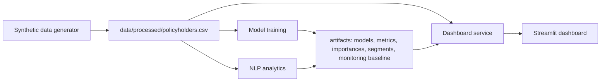

# Architecture

`src.services.dashboard_service` is the dashboard boundary: it validates artifacts, loads versioned outputs, produces inference, and calculates baseline drift. Its explicit `ArtifactUnavailableError` prevents success-shaped dashboard output when a pipeline dependency is missing.
